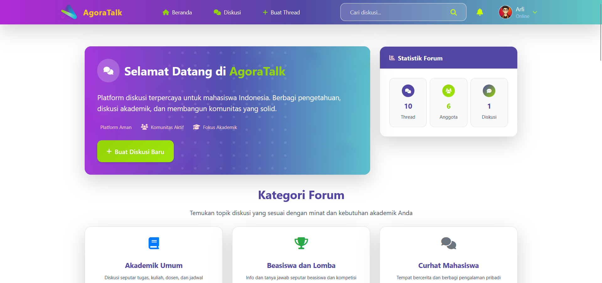
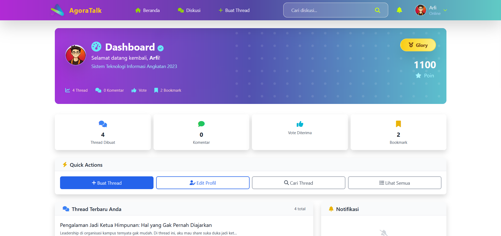
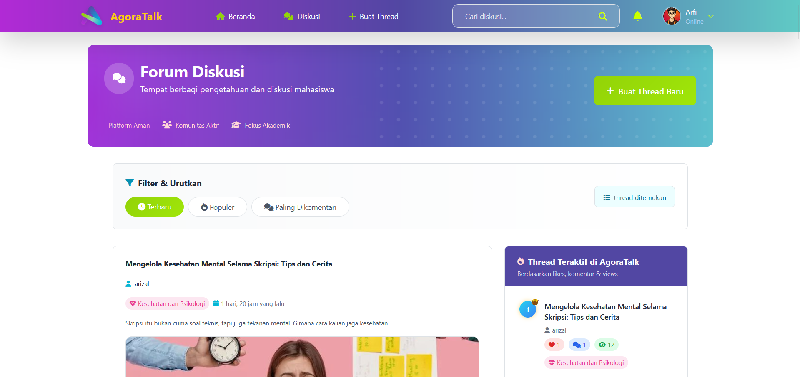
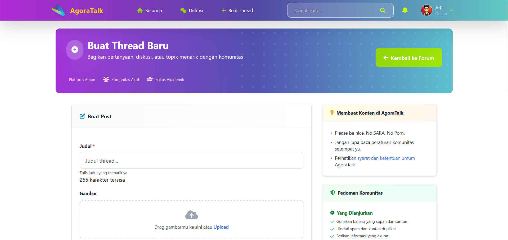
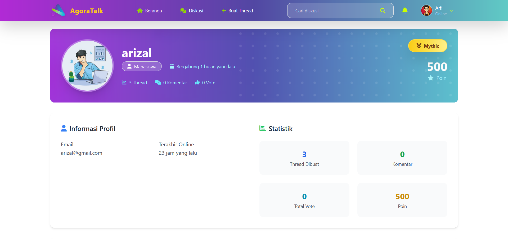
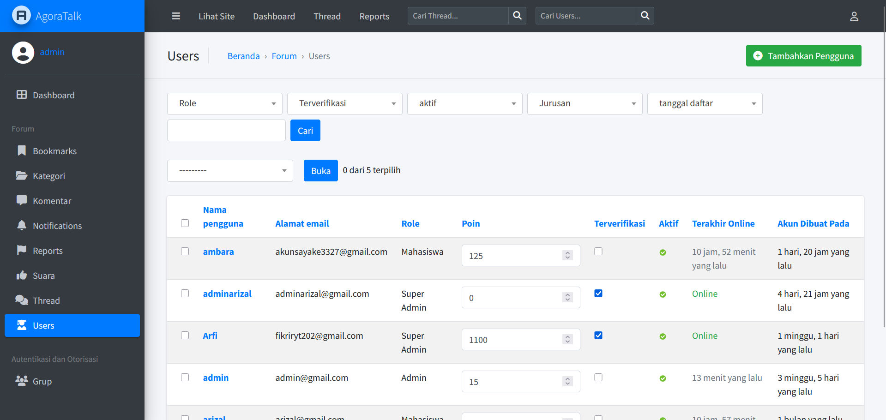

# Portal Komunitas Forum Mahasiswa

Portal ini adalah aplikasi web berbasis Django yang digunakan untuk diskusi, berbagi informasi, dan membangun komunitas antar mahasiswa.  
Fitur utama meliputi pendaftaran akun, login, pembuatan thread, komentar, voting, bookmark, notifikasi, dan dashboard profil.

## ✨ Fitur Utama

- 🔐 Registrasi & Login terpisah untuk Mahasiswa dan Admin
- 🧵 Buat Thread Diskusi dan Komentar Balasan (nested reply)
- 👍 Voting & Bookmark untuk komentar dan thread
- 📊 Dashboard Admin: Statistik forum, verifikasi user, dan manajemen laporan
- 🔔 Notifikasi sistem: reply, mention, vote
- 🔎 Pencarian thread berdasarkan judul, tag, atau user
- 🎖️ Sistem poin dan badge untuk user aktif

---

## 🛠️ Teknologi

- **Python** & **Django**
- **SQLite3** (multi-database: `db.sqlite3` untuk user & `admin_db.sqlite3` untuk admin)
- **HTML + CSS + JavaScript**
- **Bootstrap** untuk styling frontend
- **Jazzmin** untuk tampilan admin yang lebih modern
- Otentikasi kustom via `AdminAuthenticationBackend` dan `UserAuthenticationBackend`

---

## Instalasi

1. Clone repository:
   ```
   git clone https://github.com/username/portal_komunitas_forum_mahasiswa.git
   cd portal_komunitas_forum_mahasiswa
   ```
2. Install dependencies:
   ```
   pip install -r requirements.txt
   ```
3. Migrasi database:
   ```
   python manage.py migrate
   ```
4. Jalankan server:
   ```
   python manage.py runserver
   ```

## Struktur Folder

- `forum/` : App utama (models, views, forms, templates)
- `staticfiles/` : File statis (CSS, JS, gambar)
- `media/` : Upload user (gambar thread, profil)
- `config/` : Pengaturan project

## Preview

Berikut tampilan aplikasi:

## Preview

<p align="center">
  <b>Halaman Home</b><br>
  <br><br>
  <b>Halaman Dashboard Pengguna</b><br>
  <br><br>
  <b>Halaman Diskusi</b><br>
  <br><br>
  <b>Halaman Buat Thread</b><br>
  <br><br>
  <b>Halaman Profil Orang</b><br>
  <br><br>
  <b>Halaman Dashboard Admin</b><br>
  
</p>

## Kontribusi

Silakan fork dan pull request jika ingin berkontribusi.

## Lisensi

Proyek ini menggunakan lisensi MIT.


