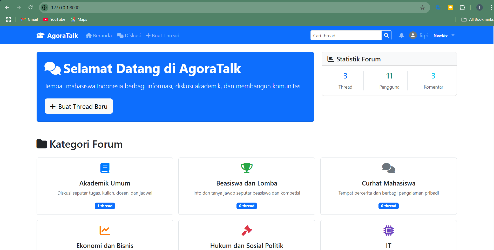
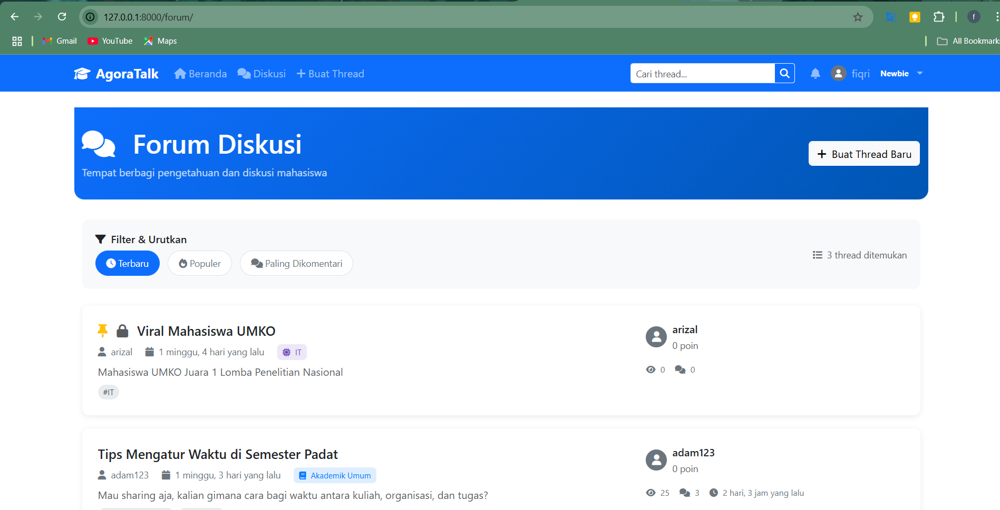
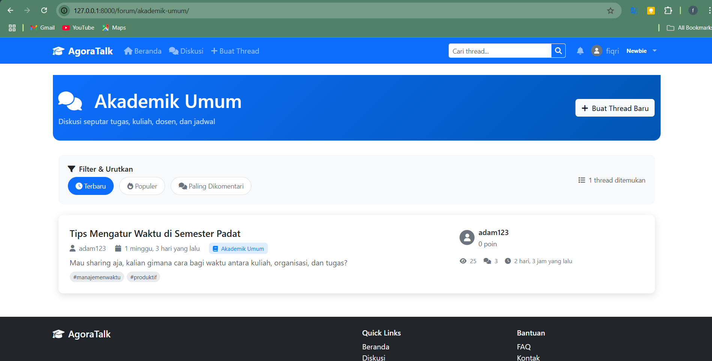
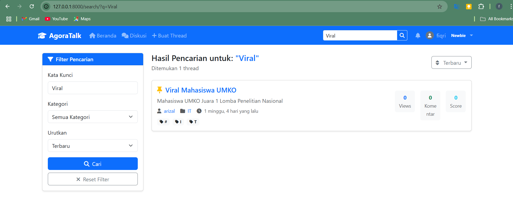
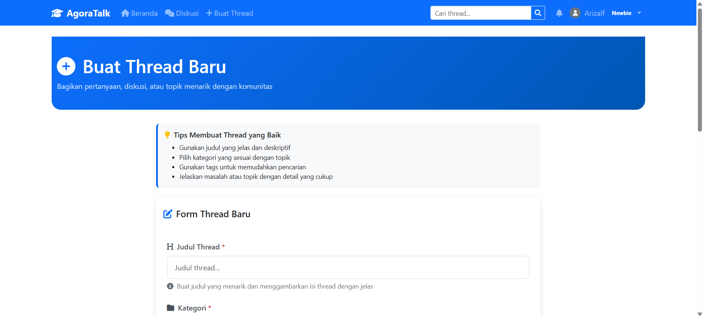

# 🎓 Portal Komunitas Forum Mahasiswa

Sebuah platform diskusi online berbasis web untuk mahasiswa lintas jurusan. Dibangun dengan framework **Django**, proyek ini menyediakan fitur diskusi berbasis thread, komentar, voting, bookmark, dan dashboard admin terpisah.

---

## ✨ Fitur Utama

- 🔐 Registrasi & Login terpisah untuk Mahasiswa dan Admin
- 🧵 Buat Thread Diskusi dan Komentar Balasan (nested reply)
- 👍 Voting & Bookmark untuk komentar dan thread
- 📊 Dashboard Admin: Statistik forum, verifikasi user, dan manajemen laporan
- 🔔 Notifikasi sistem: reply, mention, vote
- 🔎 Pencarian thread berdasarkan judul, tag, atau user
- 🎖️ Sistem poin dan badge untuk user aktif

---

## 🛠️ Teknologi

- **Python** & **Django**
- **SQLite3** (multi-database: `db.sqlite3` untuk user & `admin_db.sqlite3` untuk admin)
- **HTML + CSS + JavaScript**
- **Bootstrap** untuk styling frontend
- **Jazzmin** untuk tampilan admin yang lebih modern
- Otentikasi kustom via `AdminAuthenticationBackend` dan `UserAuthenticationBackend`

---
